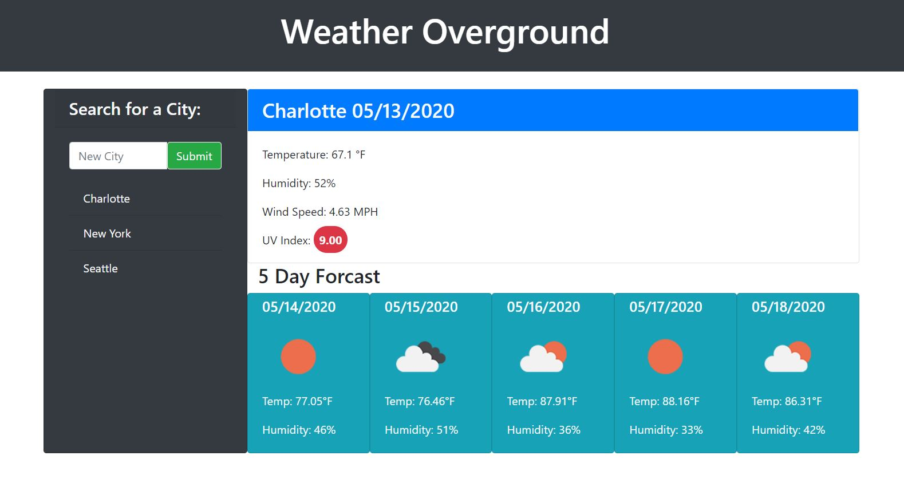

# Multi-City-Weather-App

The Weather Underground is a simple weather app, which pulls and agrogates information from a few different weather APIs.  Firstly, the city selection on the side of the app stores previous searches and allows for the user to keep cities they are interested in.

Additionally, the site will automatically load weather information on the first stored city when launched.

The UV index is displayed with a colored warning symbol, with green indicating a safer index, and yellow and red indicating increased danger.

The 5 day forecast has icons that are indicative of cloud cover and rain chance, as well as estimated temperature and humidity values.

The App also uses moment.js to configure and output dates.